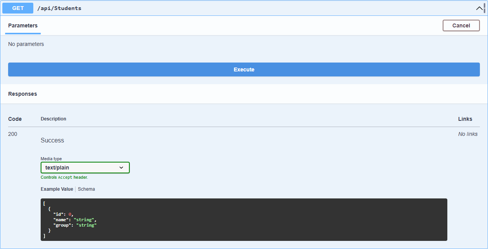
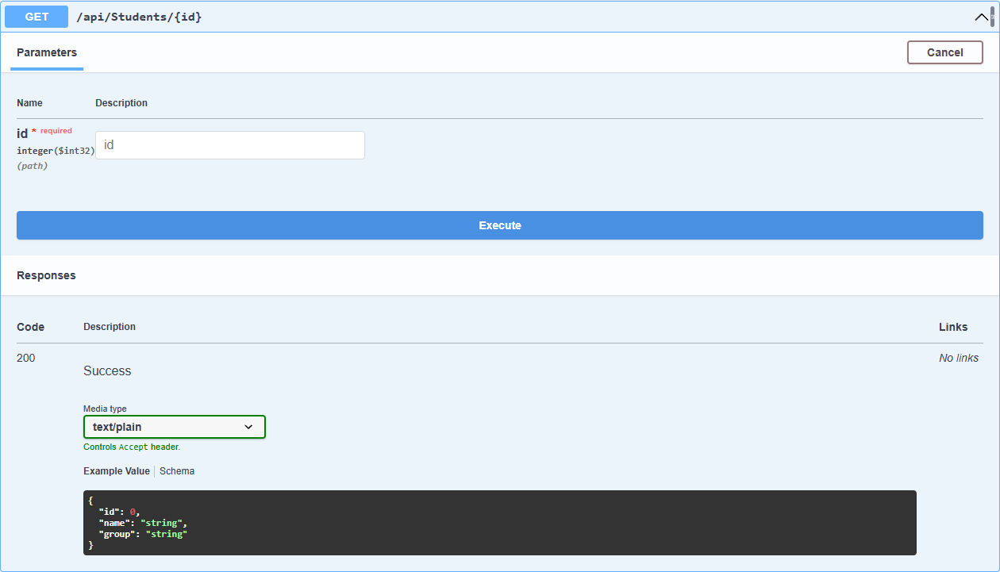
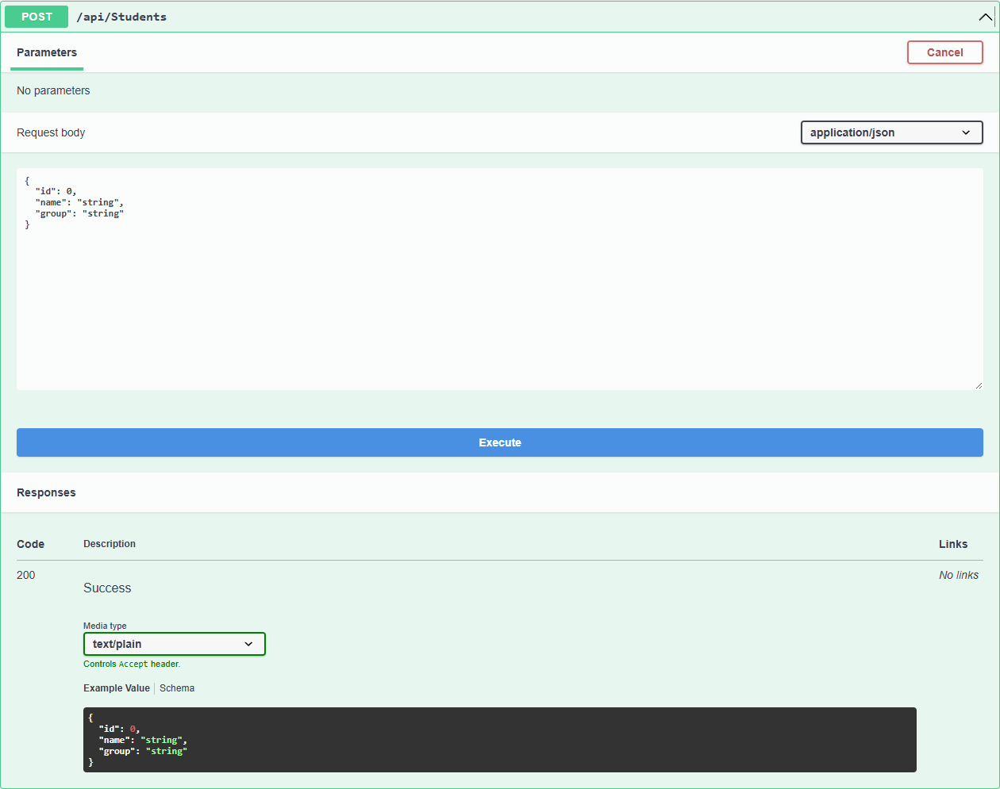

# WebApiPrac2 — Модуль 02

## Краткий отчёт

Создан ASP.NET Core Web API для хранения информации о студентах. Использованы модель `Student`, контроллер `StudentsController`, маршрутизация и Swagger UI. Данные хранятся в списке `List<Student>` в памяти приложения.

## Модель Student

Модель содержит свойства `Id`, `Name` и `Group`. В список добавлены три тестовых студента: Alex, Anna и Max.

## Реализованные endpoints

| Метод | Endpoint | Назначение | Результат |
|---|---|---|---|
| GET | `/api/students` | Получить всех студентов | `200 OK` |
| GET | `/api/students/{id}` | Получить студента по Id | `200 OK` или `404 Not Found` |
| POST | `/api/students` | Добавить студента | `200 OK` |

## Скриншоты выполнения

### GET `/api/students`

### GET `/api/students/{id}`

### POST `/api/students`

## Ответы на контрольные вопросы

1. Web API — интерфейс для обмена данными между приложениями по HTTP.
2. `ControllerBase` даёт контроллеру базовые возможности для обработки API-запросов и формирования ответов.
3. `[ApiController]` включает стандартное поведение API-контроллера и автоматическую обработку данных запроса.
4. `[Route]` задаёт URL-маршрут контроллера или метода.
5. GET получает данные, а POST добавляет новый объект.
6. `404 Not Found` означает, что запрошенный студент не найден.
